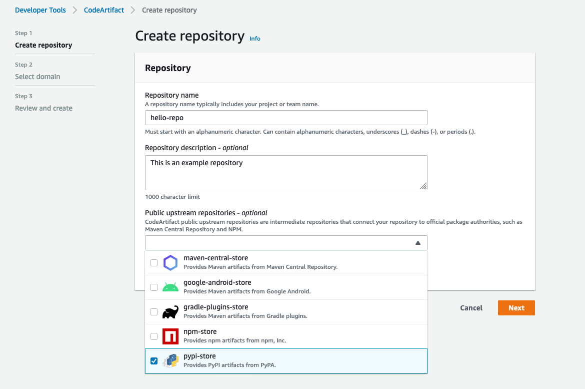
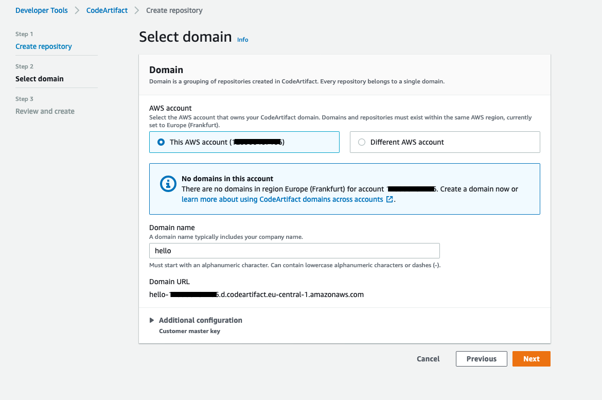

# CodeArtifact with pypi tutorial

This tutorial explains how to create a Python package using [Poetry](https://python-poetry.org/) and how to publish it to the repository
created in [AWS CodeArtifact](https://aws.amazon.com/codeartifact/).

## Setup

Clone the repository:
```
git clone git@github.com:umatbro/codeartifact-tutorial-pypi.git
cd codeartifact-tutorial-pypi
```

Setup virtualenv

```
$ python3 -m venv venv
$ source venv/bin/activate
(venv) $
```

Install poetry and project dependencies
```
pip install poetry
poetry install
```

## Create CodeArtifact repository

This part of the tutorial assumes that you already have [created your AWS account](https://aws.amazon.com/free).

Login to your account and navigate to [CodeArtifact](console.aws.amazon.com/codesuite/codeartifact/start).

Click **Create repository** button and fill in the form. In this example we will use `hello-repo` as a repository name.




Note that you should select `pypi-store` in **Public upstream repositories** if you also want to use
public packages for pypi.
By default it is not enabled and only packages uploaded manually will be available.

Click **Next** and select **This AWS account** and type in a new domain name, in this tutorial we go with `hello`.



In the last step confirm your setup by clicking **Create repository**.

## Config poetry to use `hello` repository

### Push packages

Configure a repository to upload.

```
poetry config repositories.hello-repo $(aws codeartifact get-repository-endpoint --repository hello-repo --domain hello --format pypi --query 'repositoryEndpoint' --output text)
```

This will add `hello-repo` to poetry's configuration file. Location of the config file may vary depending on the system<sup>[[1]](https://python-poetry.org/docs/configuration/#configuration) </sup>:

* macOS: `~/Library/Application Support/pypoetry`
* Windows: `C:\Users\<username>\AppData\Roaming\pypoetry`
* Linux `~/.config/pypoetry`

Now configure credentials for the new repository:
```
poetry config http-basic.hello-repo aws $(aws codeartifact get-authorization-token --domain hello --query authorizationToken --output text)
```

This configures `http-basic` credentials. By default `aws` is the user name and token obtained by running `get-authorization-token`
command is the password. This token is only valid for 12 hours so it should be renewed if expired.

Now the package can be pushed to the remote `hello` repository with following command:

```
poetry build
poetry publish --repository hello-repo
```

### Pull package

This part assumes that you need to use `hello_package` (for example as a dependency in your project).

Unfortunately Poetry currently does not work well with CodeArtifact so we have to use regular `pip` commands.

Configure your pypi client using this AWS CLI CodeArtifact command (login authorization expires in 12 hours).
```
aws codeartifact login --tool pip --repository hello-repo --domain hello
```
You can get this command by going to CodeArtifact in AWS Console and clicking **View connection instructions**.

Now it is possible to download packages from the repository:
```
pip install hello-package
```
